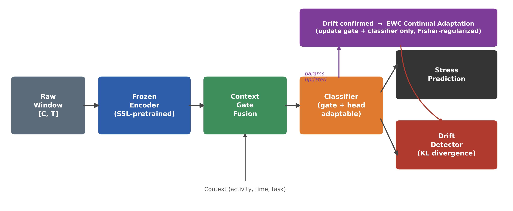
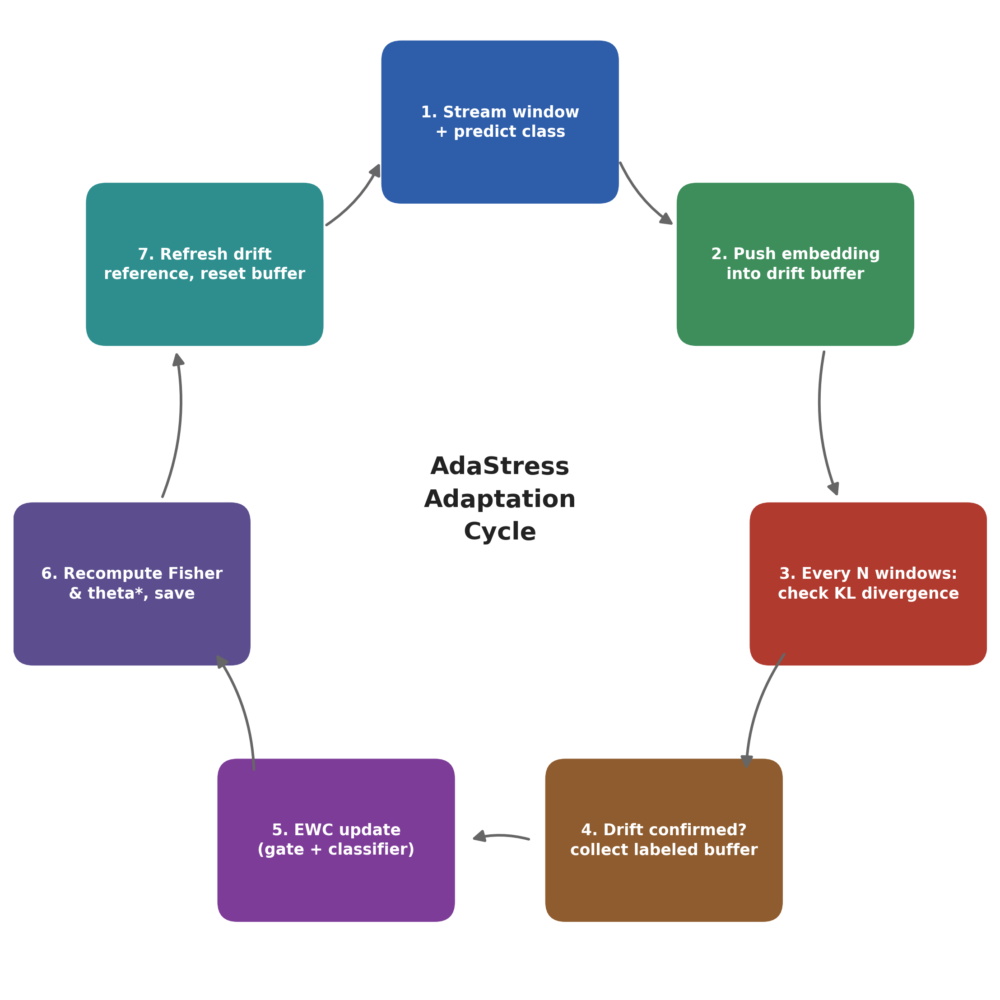

# AdaStress

Self-supervised, context-aware, drift-adaptive stress detection for wearable and edge devices.

This is the reference implementation accompanying the paper *"Adaptive Stress Monitoring on Wearable Devices for Long-Term Consumer Health"* (under review, IEEE Transactions on Consumer Electronics). It covers the full pipeline: self-supervised encoder pretraining, context-gated classification, KL-divergence drift detection, and EWC-regularized continual adaptation, plus the statistical tests used to validate every claim in the paper.

<p align="center">
  
</p>

## Why this exists

A stress model trained once and deployed forever quietly gets worse: a person's physiological baseline drifts as routines, fitness, and environment change. AdaStress does three things to deal with this without needing constant relabeling:

1. **Learns from mostly unlabeled data.** A CNN-BiLSTM encoder is pretrained with contrastive self-supervised learning, so it doesn't need much labeled data to work well downstream.
2. **Fuses context, not just physiology.** A learned gate blends the physiological embedding with contextual signals (activity, time of day, task), instead of assuming physiology alone tells the whole story.
3. **Adapts only when it actually needs to.** A lightweight KL-divergence drift detector watches the deployed model's feature distributions, and only triggers a retraining cycle when something has genuinely shifted, using Elastic Weight Consolidation (EWC) so the update doesn't overwrite what the model already knows.

## The adaptation cycle

<p align="center">
  
</p>

This loop (implemented in [`adastress/adaptation_loop.py`](adastress/adaptation_loop.py)) is the core contribution of this codebase: monitor, detect, adapt, and — critically — **refresh the drift reference against the newly adapted model** before resuming monitoring, so the next drift check isn't comparing against a stale baseline.

## Repository layout

```
adastress-toolkit/
├── adastress/                  # the actual library
│   ├── config.py               # YAML config loader
│   ├── datasets.py              # windowing, scaling, PyTorch Datasets
│   ├── models.py                 # Encoder, ContextGateFusion, MLPClassifier, StressModel
│   ├── ssl_pretrain.py            # Stage 1: contrastive encoder pretraining
│   ├── train_classifier.py         # Stage 2: classifier (+ gate) training
│   ├── drift_detection.py           # KL-divergence drift detector
│   ├── continual_learning.py         # EWC: Fisher matrix, adaptation updates
│   ├── adaptation_loop.py             # ties drift detection + EWC together
│   ├── inference.py                    # end-to-end single-window prediction
│   └── stats_tests.py                   # paired t-test, Friedman, Levene, CIs
├── scripts/                    # thin CLI entry points into the library above
├── configs/config.yaml         # every hyperparameter and path lives here
├── checkpoints/                # pretrained encoder + scaler + meta (included)
├── data/                       # small de-identified demo slice (full dataset withheld)
├── assets/                     # README figures
└── tests/test_smoke.py         # end-to-end smoke test
```

## Installation

```bash
git clone <this-repo>
cd adastress-toolkit
pip install -r requirements.txt
```

Python 3.9+ and PyTorch 2.0+. GPU is optional, everything here also runs on CPU (it needs to, since part of the point is that it runs on an edge device).

## About the bundled checkpoints and data

`checkpoints/encoder.pth`, `scaler.pkl`, and `meta.json` are the actual pretrained artifacts from the paper, a 13-channel physiological encoder producing a 256-dimensional embedding. They're included so you can run inference and the adaptation demo immediately without retraining anything.

`data/sample_data.csv` is a small, de-identified slice (a handful of subjects, ~1000 rows) included only so the full pipeline can be exercised end to end. **It is not the dataset used in the paper.** See [`data/README.md`](data/README.md) for the expected schema if you want to point this at your own data.

## Quickstart

```bash
# 1. Train the classifier (+ context gate) on top of the frozen encoder
python scripts/train_classifier.py --config configs/config.yaml

# 2. Run a single end-to-end prediction
python scripts/run_inference.py --config configs/config.yaml

# 3. Simulate deployment: stream windows, detect drift, adapt with EWC
python scripts/run_adaptation_demo.py --config configs/config.yaml --num-windows 150
```

Step 3 prints something like this when drift is confirmed and an adaptation cycle runs:

```
[adaptation_loop] drift confirmed at window 15, starting EWC adaptation
  [adapt] epoch 1/5 loss=1.0884 ce=1.0884 penalty=0.0000
  [adapt] epoch 5/5 loss=1.0717 ce=1.0716 penalty=0.0001
[adaptation_loop] model updated, Fisher/theta* saved, drift reference refreshed

*** Adaptation event at window 15 ***
    drifting features: 5
    importance mass: 0.0196 (threshold: 0.0039)
```

### Pretraining the encoder from scratch

You don't need this to use the bundled checkpoint, it's only relevant if you're retraining on your own data:

```bash
python scripts/pretrain_encoder.py --config configs/config.yaml
```

### Running the statistical tests

Every comparison in the paper (frozen encoder vs. joint fine-tuning, EWC vs. plain fine-tuning vs. L2, with vs. without the context gate) goes through the same module:

```bash
# Train under several seeds/settings and log results
python scripts/run_multi_seed_training.py --config configs/config.yaml --out results/classifier_runs.csv

# Run paired t-tests, Levene's test, and (with 3+ methods) a Friedman test
python scripts/run_stats_tests.py --results results/classifier_runs.csv --out results/stats_results.json
```

`stats_tests.py` also works as a plain importable module (`from adastress.stats_tests import paired_ttest, friedman_test, ...`) if you want to run these tests against your own results rather than through the CSV convention above.

## How the drift detector works

For every embedding dimension and every stress class, a reference distribution is learned from training data, along with a baseline score describing how much that dimension naturally varies between one class and the rest. At deployment time, a rolling buffer of recent embeddings and predictions is compared against that reference. A dimension is flagged as "drifting" if its runtime divergence from the training-time reference exceeds its own training-time baseline. A single noisy dimension isn't enough to trigger anything: drift is only confirmed once the *importance-weighted* mass of drifting dimensions (importance derived straight from the classifier's own weights) exceeds the average importance across all dimensions.

```python
from adastress.drift_detection import DriftDetector, feature_importance_from_classifier

detector = DriftDetector(num_features=256, num_classes=3, num_bins=20)
detector.fit_reference(train_embeddings, train_labels, feature_importance_from_classifier(classifier))

# ... at deployment time, per window ...
detector.push(embedding, predicted_class)
report = detector.check()
if report.is_drift:
    ...  # trigger adaptation, see adaptation_loop.py
```

## How continual adaptation works

Only the context gate and classifier are ever updated, the pretrained encoder stays frozen the entire time. When drift is confirmed:

1. A small labeled buffer is collected (opportunistic EMA responses from the user, in a real deployment).
2. The model is updated for a few epochs under an EWC penalty that keeps new parameters close to their pre-adaptation values, weighted by how important (Fisher information) each parameter was:

```python
from adastress.continual_learning import compute_fisher, adapt, named_adaptable_parameters

fisher = compute_fisher(model, adaptation_loader, device)
theta_star = {name: p.detach().clone() for name, p in named_adaptable_parameters(model).items()}

adapt(model, adaptation_loader, device, method="ewc", fisher=fisher, theta_star=theta_star)
```

3. After adaptation, the Fisher matrix and theta* are **recomputed against the updated model** and saved, and the drift detector's reference distributions are refreshed the same way, so the next drift check is measured against the new normal, not the original training snapshot. `finetune` (no regularization) and `l2` (unweighted L2 penalty) are also implemented as `method=` options, mainly so you can reproduce the ablation comparing them against EWC.

## Configuration

Everything, paths, window sizes, learning rates, drift thresholds, EWC lambda, lives in [`configs/config.yaml`](configs/config.yaml). Nothing in the codebase hardcodes a path or hyperparameter outside of it. The drift and continual-learning thresholds shipped in the config are set small on purpose to work with the tiny bundled demo dataset; turn `drift.min_buffer_for_check` and `continual_learning.adapt_batch_size` back up once you're running against a real, larger dataset (comments in the config explain where).

## Tests

```bash
python -m pytest tests/ -v
```

Trains for one epoch and runs one full drift-check-and-adapt cycle on the bundled sample data. It's a smoke test, not a benchmark, it's there to catch broken imports and shape mismatches before you push, not to validate model quality.

## Citation

If you use this code, please cite:

```bibtex
@article{ara2026adastress,
  title   = {Adaptive Stress Monitoring on Wearable Devices for Long-Term Consumer Health},
  author  = {Ara, Tarannum and Mitra, Bivas},
  journal = {IEEE Transactions on Consumer Electronics},
  year    = {2026},
  note    = {Under review}
}
```

## License

MIT, see [LICENSE](LICENSE).
